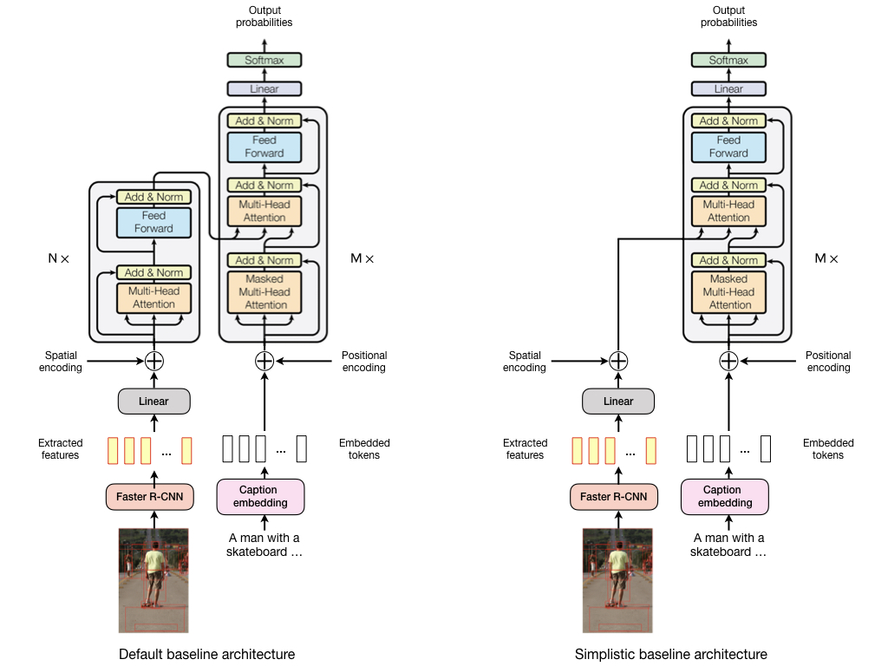
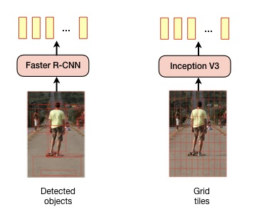
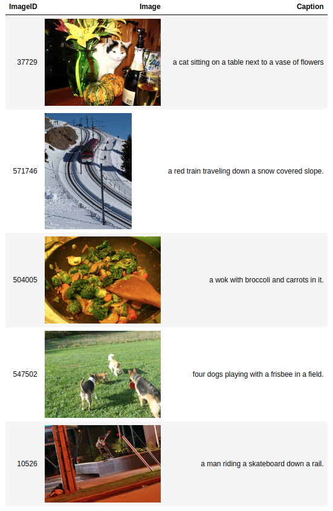

# Image Captioning Transformer

This projects extends [pytorch/fairseq](https://github.com/pytorch/fairseq) with 
[Transformer](https://arxiv.org/abs/1706.03762)\-based image captioning models. It is still **work in progress** and 
inspired by the following papers:

<table>
  <tr>
    <td valign="top">[1]</td>
    <td>Steven J. Rennie, Etienne Marcheret, Youssef Mroueh, Jarret Ross, Vaibhava Goel. <a href="https://arxiv.org/abs/1612.00563">Self-critical Sequence Training for Image Captioning</a>. In <i>Computer Vision and Pattern Recognition</i>, pages 1179–1195, 2017.</td>
  </tr>
  <tr>
    <td valign="top">[2]</td>
    <td>Peter Anderson, Xiaodong He, Chris Buehler, Damien Teney, Mark Johnson, Stephen Gould, Lei Zhang. <a href="https://arxiv.org/abs/1707.07998">Bottom-up and top-down attention for image captioning and visual question answering</a>. In <i>Proceedings of the IEEE Conference on Computer Vision and Pattern Recognition</i>, pages 6077–6086, 2018.</td>
  </tr>
  <tr>
    <td valign="top">[3]</td>
    <td>Ashish Vaswani, Noam Shazeer, Niki Parmar, Jakob Uszkoreit, Llion Jones, Aidan N. Gomez, Łukasz Kaiser, and Illia Polosukhin. <a href="https://arxiv.org/abs/1612.00563">Attention is all you need</a>. In <i>Advances in neural information processing systems</i>, pages 5998–6008, 2017.</td>
  </tr>
  <tr>
    <td valign="top">[4]</td>
    <td> Marcella Cornia, Matteo Stefanini, Lorenzo Baraldi, Rita Cucchiara. <a href="https://arxiv.org/abs/1912.08226">M2: Meshed-memory transformer for image captioning</a>. <i>arXiv preprint</i> arXiv:1912.08226, 2019.</td>
  </tr>
</table>

Only baseline models are available at the moment, incl. [pre-trained models](#pre-trained-baseline-models). Their 
[architecture](#baseline-architecture) is based on a vanilla Transformer. More specialized architectures e.g. as
described in \[4\] are coming soon.

## Baseline architecture

The following figure gives an overview of the baseline model architectures. 



The *default baseline architecture* uses a Transformer encoder for self-attention on visual features and a Transformer 
decoder for masked self-attention on caption tokens and for visio-linguistic (= encoder-decoder) attention. A linear 
layer projects visual features into the usually lower-dimensional representation space of the encoder. 

The *simplistic baseline architecture* doesn't use a Transformer encoder and projected visual features are directly 
processed by the Transformer decoder. In both architectures, visual features from images can be either extracted  with 
a Faster R-CNN model as described in \[2\] or from fixed grid tiles (8x8) using an Inception V3 model.   



## Fairseq extensions

The following extensions to the [fairseq command line tools](https://fairseq.readthedocs.io/en/latest/command_line_tools.html) are implemented:

- `--task captioning`. Enables the image captioning functionality. 
- `--arch default-captioning-arch`. Uses a transformer encoder to process image features (3 layers by default) and a 
  transformer decoder to process image captions and encoder output (6 layers by default). The number of encoder and 
  decoder layers can be adjusted with `--encoder-layers` and `--decoder-layers`, respectively.
- `--arch simplistic-captioning-arch`. Uses the same decoder as in `default-captioning-arch` but no transformer encoder.
  Image features are processed directly by the decoder after projecting them into a lower-dimensional space which can
  be controlled with `--encoder-embed-dim`. Projection into lower-dimensional space can be skipped with `--no-projection`.
- `--features obj`. Use image features extracted from detected objects as described in \[3\].
  Additionally use `--max-source-positions 100` when using this option.
- `--features grid`. Use image features extracted from an 8 x 8 grid. Inception v3 is used for extracting image features. 
  Additionally use `--max-source-positions 64` when using this option. 
- `--feature-spatial-encoding`. Learn spatial (2D-positional) encoding of bounding boxes or grid tiles. Disabled by default. 
  Positional encodings are learned from bounding box or grid tile coordinates and their size.
- `--criterion self_critical_sequence_training`. Enables self-critical sequence training (SCST) \[1\] with modifications 
  described in \[4\]. The beam size during SCST can be configured with `--scst-beam` (default is 5) and the beam 
  search length penalty with `--scst-penalty` (default is 1.0). Please note that SCST uses a custom sequence generator
  so that back-propagation through beam search is possible.

## Setup

### Environment

- Install [NCCL](https://github.com/NVIDIA/nccl) for multi-GPU training.
- Install [apex](https://github.com/NVIDIA/apex) with the `--cuda_ext` option for faster training.
- Create a conda environment with `conda env create -f environment.yml`.
- Activate the conda environment with `conda activate fairseq-image-captioning`.

### Evaluation tools 

For model evaluation and self-critical sequence training a [Python 3 Fork](https://github.com/flauted/coco-caption) of 
the [COCO Caption Evaluation](https://github.com/tylin/coco-caption) library is used. This library is included
as a [Git Submodule](https://git-scm.com/book/en/v2/Git-Tools-Submodules) in the path `external/coco-caption`. 
Download the submodule with the following commands:

```
git submodule init
git submodule update
``` 

Furthermore, the COCO Caption Evaluation library uses the [Stanford CoreNLP 3.6.0](https://stanfordnlp.github.io/CoreNLP/index.html) 
toolset which must be downloaded separately. It is important to change into the submodule's root folder before executing 
the script to download the required files:

```
cd external/coco-caption
./get_stanford_models.sh
```

Finally, update `PYTHONPATH` to include the evaluation tools.

```
export PYTHONPATH=./external/coco-caption
```

### Dataset

Models are trained with the MS-COCO dataset. To setup the dataset for training, create an `ms-coco` directory in the 
project's root directory, download MS-COCO 2014

- [training images](http://images.cocodataset.org/zips/train2014.zip) (13 GB)
- [validation images](http://images.cocodataset.org/zips/val2014.zip) (6 GB)
- [annotations](http://images.cocodataset.org/annotations/annotations_trainval2014.zip) (241 MB)

to the created `ms-coco` directory and extract the archives there. The resulting directory structure should look like

```
ms-coco
  annotations
  images
    train2014
    val2014
```

MS-COCO images are needed when training with the `--features grid` command line option. Image features are then extracted
from a fixed 8 x 8 grid on the image. When using the `--features obj` command line option image features are extracted 
from detected objects as described in \[2\].
 
Pre-computed features of detected objects (10-100 per image) are available in [this repository](https://github.com/peteanderson80/bottom-up-attention). 
You can also use [this link](https://imagecaption.blob.core.windows.net/imagecaption/trainval.zip) to download them 
directly (22 GB). After downloading, extract the `trainval.zip` file, rename the `trainval` directory to `features` and 
move it to the `ms-coco` directory. The `ms-coco/features` directory should contain 4 `.tsv` files:

```
ms-coco
  annotations
  features
    karpathy_test_resnet101_faster_rcnn_genome.tsv
    karpathy_train_resnet101_faster_rcnn_genome.tsv.0
    karpathy_train_resnet101_faster_rcnn_genome.tsv.1
    karpathy_val_resnet101_faster_rcnn_genome.tsv
  images
    train2014
    val2014
```

## Pre-processing

For splitting the downloaded MS-COCO data into a training, validation and test set, [Karpathy splits](splits) are used. 
Split files have been copied from [this repository](https://github.com/peteanderson80/bottom-up-attention/tree/master/data/genome/coco_splits).
Pre-processing commands shown in the following sub-sections write their results to the `output` directory by default.  

### Pre-process captions

    ./preprocess_captions.sh ms-coco

Converts MS-COCO captions into a format required for model training. 

### Pre-process images

    ./preprocess_images.sh ms-coco

Converts MS-COCO images into a format required for model training. Only needed when training with the `--features grid`
command line option.

### Pre-process object features

    ./preprocess_features.sh ms-coco/features

Converts pre-computed object features into a format required for model training. Only needed when training with the 
`--features obj` command line option.

## Training

Captioning models are first trained with a cross-entropy loss and then fine-tuned with self-critical sequence training
(SCST) \[1\]. SCST directly optimizes the CIDEr metric.

### Cross-entropy loss

For training a default baseline model with a cross-entropy loss use the following command. **Please note that this 
is just an example, hyper-parameters are not tuned yet**. 

```
python -m fairseq_cli.train \
  --save-dir .checkpoints \
  --user-dir task \
  --task captioning \
  --arch default-captioning-arch \
  --encoder-layers 3 \
  --decoder-layers 6 \
  --features obj \
  --feature-spatial-encoding \
  --optimizer adam \
  --adam-betas "(0.9,0.999)" \
  --lr 0.0003 \
  --lr-scheduler inverse_sqrt \
  --min-lr 1e-09 \
  --warmup-init-lr 1e-8 \
  --warmup-updates 8000 \
  --criterion label_smoothed_cross_entropy \
  --label-smoothing 0.1 \
  --weight-decay 0.0001 \
  --dropout 0.3 \
  --max-epoch 25 \
  --max-tokens 4096 \
  --max-source-positions 100 \
  --encoder-embed-dim 512 \
  --num-workers 2
```

### Self-critical sequence training

SCST is still experimental. A chosen baseline checkpoint e.g. `.checkpoints/checkpoint20.pt` can be fine-tuned via SCST 
with the following command. **Again this is just an example, hyper-parameters are not tuned yet**.  

```
python -m fairseq_cli.train \
  --restore-file .checkpoints/checkpoint20.pt \
  --save-dir .checkpoints-scst \
  --user-dir task \
  --task captioning \
  --arch default-captioning-arch \
  --encoder-layers 3 \
  --decoder-layers 6 \
  --features obj \
  --feature-spatial-encoding \
  --optimizer adam \
  --adam-betas "(0.9,0.999)" \
  --reset-optimizer \
  --lr 5e-6 \
  --weight-decay 0.0001 \
  --criterion self_critical_sequence_training \
  --dropout 0.3 \
  --max-epoch 24 \
  --max-sentences 5 \
  --max-source-positions 100 \
  --max-target-positions 50 \
  --encoder-embed-dim 512 \
  --tokenizer moses \
  --bpe subword_nmt \
  --bpe-codes output/codes.txt \
  --ddp-backend=no_c10d \
  --scst-beam 5 \
  --scst-penalty 1.0 \
  --scst-validation-set-size 0 \
  --num-workers 2
```

In this example, validation is skipped (`scst-validation-set-size 0`) and the result after 4 epochs is used. Saving
of best checkpoints during training based on validation CIDEr metrics is not implemented yet. At the moment, checkpoints 
are saved after each epoch and must be evaluated separately as described in section [Evaluation](#evaluation).

Option `--max-epoch` should be set to the epoch number of the chosen baseline checkpoint incremented by 4. For example, 
with checkpoint `.checkpoints/checkpoint20.pt` set `--max-epoch` to `24`. Option `--ddp-backend=no_c10d` should be used 
when training on multiple GPUs.

### Pre-trained baseline models

Checkpoint 20 from training with cross-entropy loss and checkpoint 24 from self-critical sequence training are available
for download. 

- [checkpoint 20](https://martin-krasser.de/image-captioning/checkpoint20.pt)
- [checkpoint 24](https://martin-krasser.de/image-captioning/checkpoint24.pt) 

They have been trained on two NVIDIA GTX 1080 cards (8GB memory each). Evaluation results of these checkpoints are shown 
in the following table and compared to single-model evaluation results in \[2\], all evaluated on the Karpathy test split.

| Model | Criterion | Beam size | BLEU-1<sup>*</sup> | BLEU-4<sup>*</sup> | METEOR | ROUGE-L | CIDEr | SPICE |
| :--- | :--- | :----: | :----: | :----: | :-----: | :---: | :----: | :----: |
| Checkpoint 20 | Cross-entropy | 3 | 74.8 | 34.8 | 28.0 | 56.2 | 112.9 | 21.1 |
| Checkpoint 24 | SCST | 5 | 79.3 | **39.1** | **28.1** | **58.3** | **125.0** | **22.0** |
| Up-Down \[2\] | SCST | 5 | **79.8** | 36.3 | 27.7 | 56.9 | 120.1 | 21.4 |

<sup>*</sup> It must be investigated if there's an [inconsistency in reported BLEU scores](https://arxiv.org/abs/1804.08771).

## Evaluation

### Generate captions 

Captions can be generated for images in the Karpathy test split with the following command.

```
python generate.py \
  --user-dir task \
  --features obj \
  --tokenizer moses \
  --bpe subword_nmt \
  --bpe-codes output/codes.txt \
  --beam 5 \
  --split test \
  --path .checkpoints-scst/checkpoint24.pt \
  --input output/test-ids.txt \
  --output output/test-predictions.json
```

This example uses checkpoint 24 from the SCST training run (`--path .checkpoints-scst/checkpoint24.pt`) and stores the 
generated captions in `output/test-predictions.json`.

### Calculate metrics  

Metrics can be calculated with the `score.sh` script. This script uses the specified reference captions as the
ground truth and evaluates the model based on the generated captions provided as a JSON file (created with the 
`generate.py` script). The following example calculates metrics for captions contained in 
`output/test-predictions.json`.

```
./score.sh \
  --reference-captions external/coco-caption/annotations/captions_val2014.json \
  --system-captions output/test-predictions.json
```

Note `output/test-predictions.json` contains captions generated for the Karpathy test split which is a subset of the
images contained in the official MS-COCO validation set `external/coco-caption/annotations/captions_val2014.json`. For 
captions generated with the provided [checkpoint 24](https://martin-krasser.de/image-captioning/checkpoint24.pt) 
this should produce an output like

```
...

Scores:
=======
Bleu_1: 0.793
Bleu_2: 0.647
Bleu_3: 0.508
Bleu_4: 0.391
METEOR: 0.281
ROUGE_L: 0.583
CIDEr: 1.250
SPICE: 0.220
```

## Demo

To generate captions with the provided [checkpoint 24](https://martin-krasser.de/image-captioning/checkpoint24.pt) 
for some test set images contained in [demo/demo-ids.txt](demo/demo-ids.txt), run the following command: 

```
python generate.py \
--user-dir task \
--features obj \
--tokenizer moses \
--bpe subword_nmt \
--bpe-codes output/codes.txt \
--beam 5 \
--split test \
--path checkpoint24.pt \
--input demo/demo-ids.txt \
--output demo/demo-predictions.json
```

You should see an output like

```
Predictions:
============
388677: a police officer riding a motorcycle on a street.
104421: a dog chasing a frisbee in a field.
268363: a baby sleeping next to a teddy bear.
489611: a young boy holding a video game controller.
147915: a stop sign with graffiti on it.
188795: a building with a clock tower at night.
```

Notebook [viewer.ipynb](viewer.ipynb) displays generated captions together with their images.



You can of course use this viewer to show all results in `output/test-predictions.json` too.
